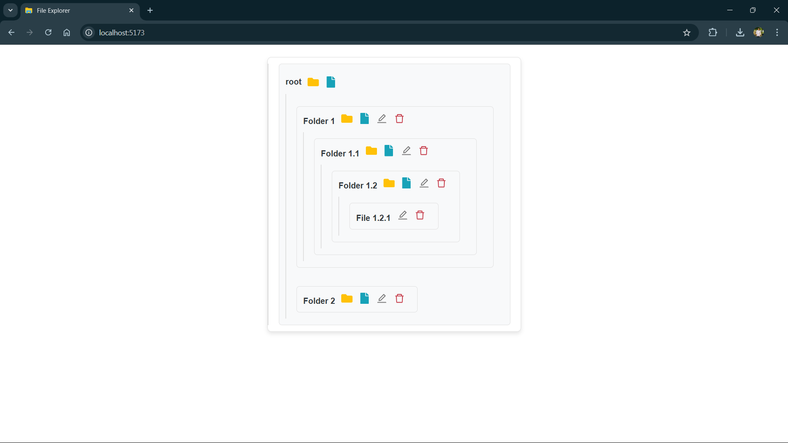

# File Explorer

A simple file explorer application built with Vite that allows users to create, rename, and delete folders and files in a hierarchical structure.

## Features

- **Create Folders:** Add new folders within existing folders.
- **Create Files:** Add new files within existing folders.
- **Rename:** Rename any folder or file.
- **Delete:** Remove any folder or file from the hierarchy.
- **Real-time Updates:** The file structure updates in real-time as changes are made.

## Demo

## Usage
- Click the folder icon (📁) next to a folder to add a new folder inside it.
- Click the file icon (📄) next to a folder to add a new file inside it.
- Click the edit icon (✏️) next to any folder or file to rename it.
- Click the delete icon (🗑️) next to any folder or file to delete it.

## Code Structure
- FileExplorer.js: The main component that handles the file and folder management logic.
- App.css: Contains the styling for the application, including custom icon colors and layout.

## Technologies Used
- React: For building the user interface.
- Vite: For fast development and build tooling.
- React Icons: For icons used in the file explorer (FaFolder, FaFile, AiOutlineDelete, AiOutlineEdit).
- UUID: For generating unique IDs for files and folders.

## Vite Plugins
- This project uses Vite for fast development and build tooling. Vite supports two official plugins for React:

- @vitejs/plugin-react: Uses Babel for Fast Refresh.
- @vitejs/plugin-react-swc: Uses SWC for Fast Refresh.

## Credits

**Created by Ayush Patel.**
